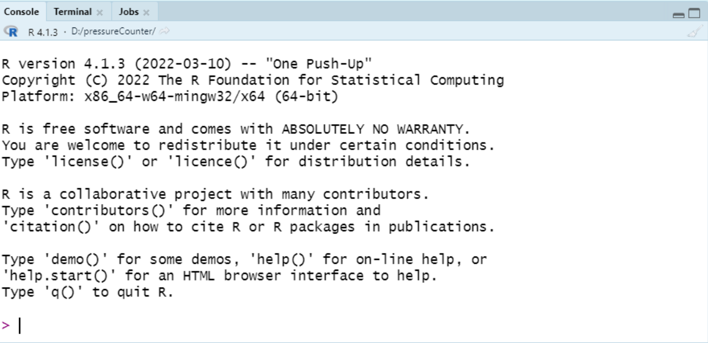
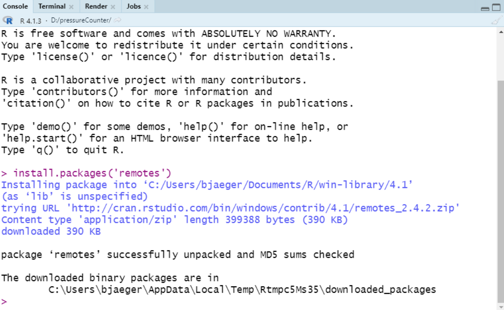
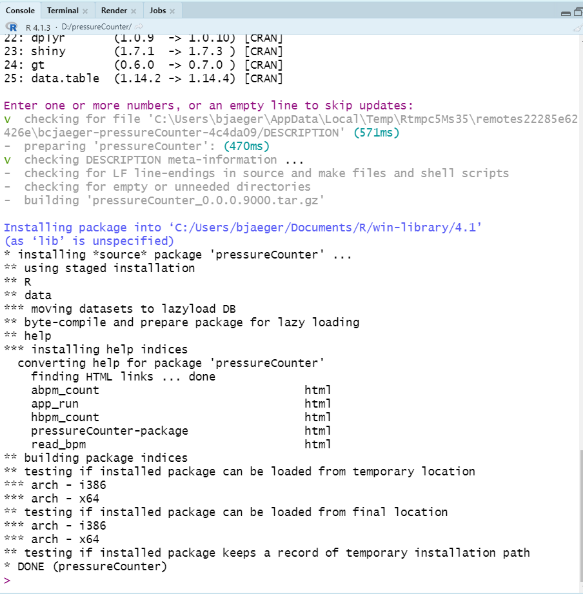
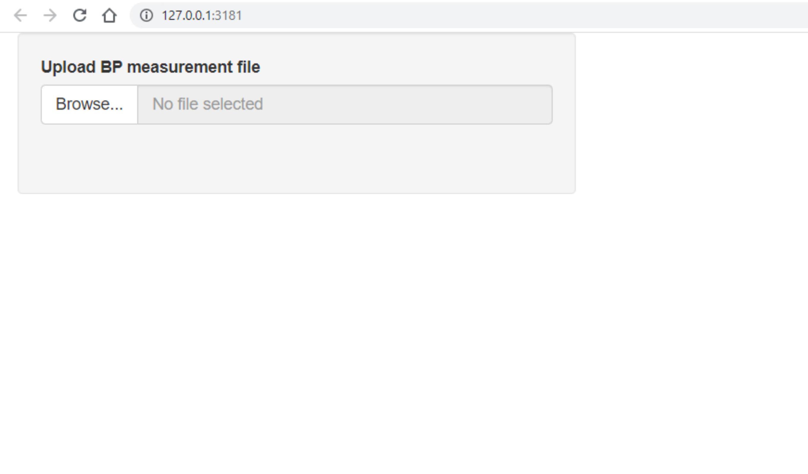

<!-- README.md is generated from README.Rmd. Please edit that file -->

```{r, include = FALSE}
knitr::opts_chunk$set(
  collapse = TRUE,
  comment = "#>",
  fig.path = "man/figures/README-",
  out.width = "100%"
)
```

# pressureCounter

The goal of pressureCounter is to count the number of blood pressure measurements in the output file from ambulatory and home blood pressure monitoring devices.

## Installation

**First, install R:** 

- Go to this page: https://cran.r-project.org/bin/windows/base/

- For windows users, click the link at the top: "Download R-4.2.2 for Windows". If the version numbers in this text are something other than 4.2.2, no need to worry.

- Once the file has downloaded, open it and complete the installation using the default options (i.e., click 'next' or 'accept defaults' on all of the windows)

**Next, install Rstudio:** 

- Go to this page: https://www.rstudio.com/products/rstudio/download/

- Scroll down until you see the image below. Click the blue button that says "Download Rstudio" (It may vary depending on your operating system and version of Rstudio that is currently live)

```{r echo=FALSE}
knitr::include_graphics('man/img/rstudio_download.png')
```

- One the file has downloaded, open it and complete the installation using default options. 

**Next, install this R package**

- Open Rstudio, you should see several panels in the window that appears. One of these windows is your console - it should look like the screenshot below. Don't worry if you have different text in your console. That just means you have a different version of R, which is okay.

```{r echo=FALSE}

```

- In your console, type the following command and press enter. 

  ```{r echo=TRUE, eval=FALSE}
  install.packages('remotes')
  ```

- You should see something like the screenshot below after the command is run. If you see a warning about installing Rtools, don't worry about it. You shouldn't need it for this project.

```{r echo=FALSE}

```

- With remotes installed, you can now run this command in the console. If you are asked whether you'd like to update any existing packages, press enter to skip the updates.

```{r echo=TRUE, eval=FALSE}
remotes::install_github('bcjaeger/pressureCounter')
```

- You should see something like the screenshot below after the command is run.

```{r echo=FALSE}

```

**Next, run the application locally**

- Now that `pressureCounter` is installed, run the following command in your console: 

```{r, echo=TRUE, eval=FALSE}
pressureCounter::app_run()
```

- You should see a window appear that looks like this:

```{r echo=FALSE}

```

- Click on "Browse files" and select an ABPM file to upload. 

- Once the file is uploaded, a table should appear to the right of the file upload box that shows the counted number of home and ambulatory blood pressure measurements.

