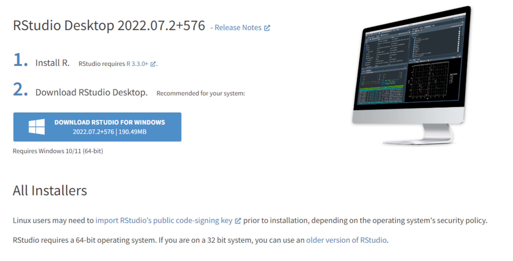
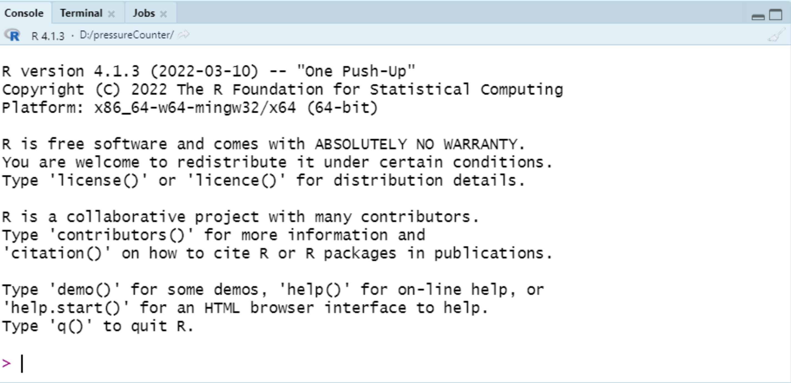
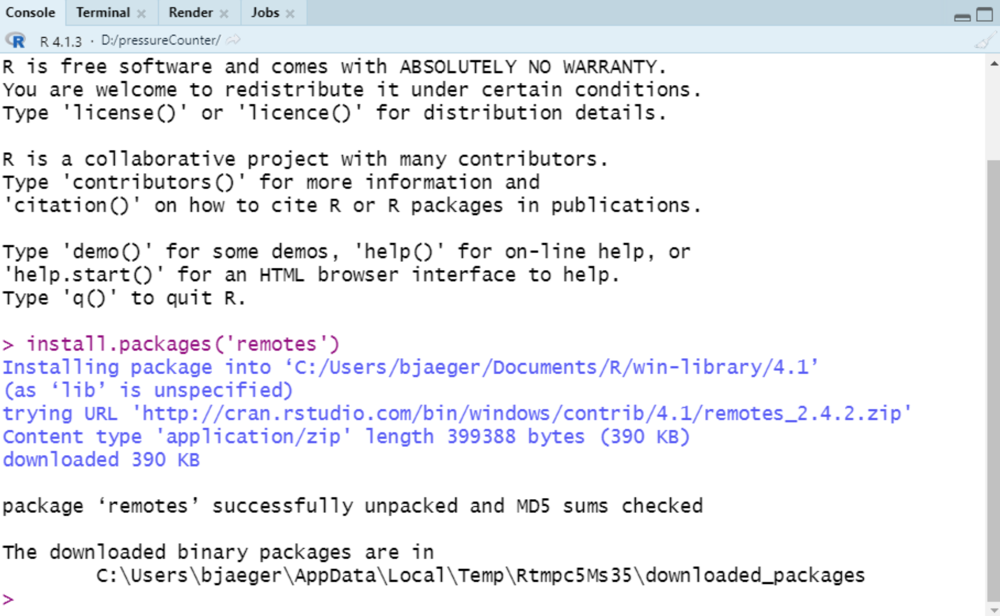
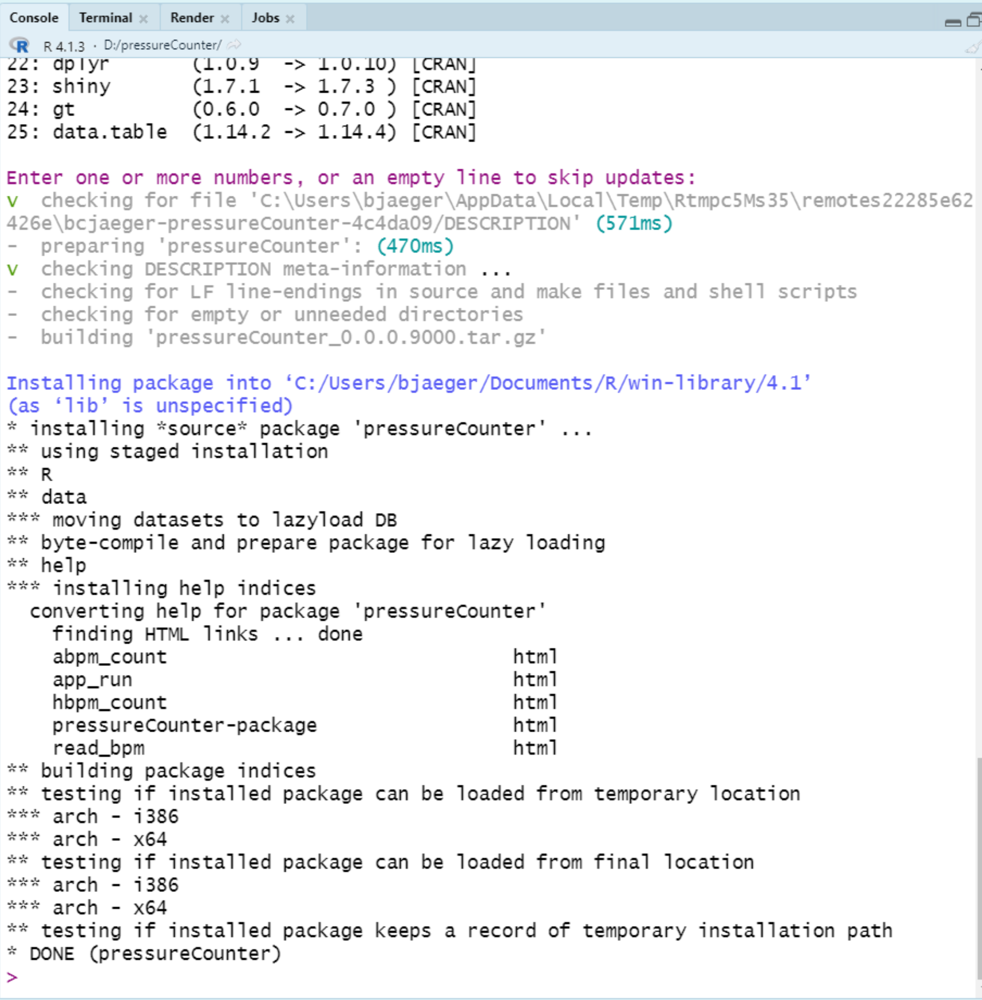
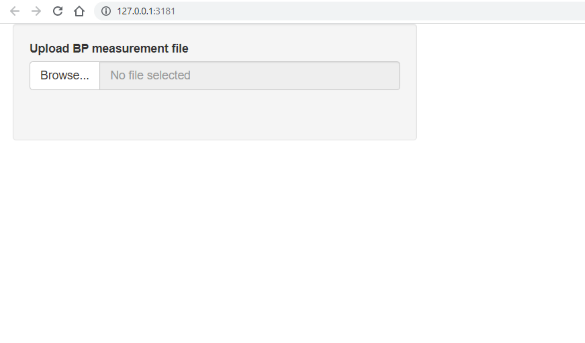

<!-- README.md is generated from README.Rmd. Please edit that file -->

# pressureCounter

The goal of pressureCounter is to count the number of blood pressure
measurements in the output file from ambulatory and home blood pressure
monitoring devices.

## Installation

**1. install R:**

- Go to this page: <https://cran.r-project.org/bin/windows/base/>

- For windows users, click the link at the top: “Download R-4.2.2 for
  Windows”. If the version numbers in this text are something other than
  4.2.2, no need to worry.

- Once the file has downloaded, open it and complete the installation
  using the default options (i.e., click ‘next’ or ‘accept defaults’ on
  all of the windows)

**2. install Rstudio:**

- Go to this page: <https://www.rstudio.com/products/rstudio/download/>

- Scroll down until you see the image below. Click the blue button that
  says “Download Rstudio” (It may vary depending on your operating
  system and version of Rstudio that is currently live)



- One the file has downloaded, open it and complete the installation
  using default options.

**3. install necessary R packages**

**Note**: While it is possible to install R packages from the base R
GUI, it is usually more straightforward to install them with Rstudio.

- Open Rstudio, you should see several panels in the window that
  appears. One of these windows is your console - it should look like
  the screenshot below. Don’t worry if you have different text in your
  console. That just means you have a different version of R, which is
  okay.



- In your console, type the following command and press enter.

  ``` r
  install.packages('remotes')
  ```

- You should see something like the screenshot below after the command
  is run. If you see a warning about installing Rtools, don’t worry
  about it. You shouldn’t need it for this project.



- With remotes installed, you can now run this command in the console.
  If you are asked whether you’d like to update any existing packages,
  press enter to skip the updates.

``` r
remotes::install_github('bcjaeger/pressureCounter')
```

- You should see something like the screenshot below after the command
  is run.



**4. Run the application locally**

- Now that `pressureCounter` is installed, run the following command in
  your console:

``` r
pressureCounter::app_run()
```

- You should see a window appear that looks like this:



- Click on “Browse” and select an ABPM file to upload. It must be a .csv
  file.

- Once the file is uploaded, a table should appear to the right of the
  file upload box that shows the counted number of home and ambulatory
  blood pressure measurements.

## Frequently asked questions

**Do you need to complete all of these steps every time you run the
application?**

No, steps 1 through 3 only need to be completed once. Once R, Rstudio,
and the necessary packages are installed, you only need to open Rstudio
and run the command `pressureCounter::app_run()` from the console to
access the application.
